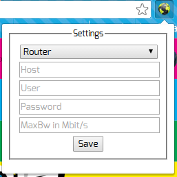
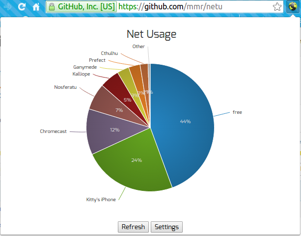

[](https://travis-ci.org/mmr/netu/)
# NetU
Sharing wifi with 5 other people at home?

NetU will help you raise the awareness about each others consumption.
And, indirectly, let you perceive if there are devices with some crazy
spyware/spambot/virus installed, consuming your entire bandwidth by
silently downloading the Internet, leaving nothing for the others.

## Settings
You have to configure the plugin before using.

- `Router`: Your router type (must be one of the supported types);
- `Host`: IP Address to access the router;
- `User`: Username to access the router;
- `Password`: Password to access the router;
- `MaxBw`: the maximum bandwidth for your Internet connection in  Mbits/second (ex: 100).

### Clean settings


### Example settings

* This is using the `TEST` router. This is meant to test the plugin

## Chart
With the correct settings, click the `Save` button and you should
get a nice pie chart depicting your local network Internet usage.

### Examples



## Implementation details
NetU is a very simple Chrome plugin that talks directly to the Wifi
router to collect the download statistics and shows it in a
nice pie chart.

## How to install
You have to clone this repo and download the dependencies using `npm`.

To do this, in a shell, execute the following commands:
```bash
$ git clone https://github.com/mmr/netu
$ cd netu
$ npm install
```

Now, to install the plugin in Chrome, do this:

1. Go to `chrome://extensions`;
1. Mark the `Developer mode` checkbox;
1. Click on `Load unpacked extension`;
1. Go to the `netu` directory you've created;

You are all set! :)

Just click the neat icon that appeared on the right side of your address bar
and configure the plugin. See [Settings](#settings).

### Technologies used:
- [NPM](https://www.npmjs.com/)
- [D3](http://d3js.org/)
- [D3Pie](http://d3pie.org/)

### Supported routers:
- [TP-LINK TL-WR941ND](http://www.tp-link.com.br/products/details/cat-9_TL-WR941ND.html)

Your router is not in the list?
Help us! Send a pull request with some code to support your router.

It is **easy**!

Just take a lot at the [current implementations](src/routers/)
